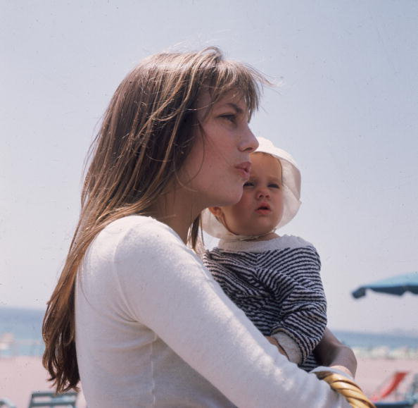

# @birkin100pre

Bot de twitter que publica una imagen cada día usando tweepy




### Configuración

Crea una nueva app en:
https://apps.twitter.

Y reemplaza los valores de las credenciales 
```
credentials.py


CONSUMER_KEY        = 'XXXXXXXXXXXXXXXXXXXXXXXXX'
CONSUMER_SECRET     = 'XXXXXXXXXXXXXXXXXXXXXXXXXXXXXXXXXXXXXXXXXXXXXXXXXX'
ACCESS_TOKEN        = 'XXXXXXXXXXXXXXXXXXXXXXXXXXXXXXXXXXXXXXXXXXXXXXXXXX'
ACCESS_TOKEN_SECRET = 'XXXXXXXXXXXXXXXXXXXXXXXXXXXXXXXXXXXXXXXXXXXXX'

```

### Instalación

```
pip install -r requirements.txt
```

### Ejecutar

Para comenzar solo entra al sitio.

Para detener entra a la dirección:
```
/detener
```
### Personalizar

Las fotos se encuentran en la carpeta
```
/static/fotos/
```
Deben tener el mismo nombre y extensión, y terminar con un número.
```
janebirkin1.jpg
janebirkin2.jpg
janebirkin3.jpg
...
```

Para cambiar el intérvalo de tiempo hay que modificar la línea:
```
    schedule.every().day.at("10:00").do( tweet_image ).run()
```
más info en:
https://schedule.readthedocs.io/en/stable/

